<table>
<tr>
<td>

# Kathan Somani

**Security Engineer · Data Protection · Zero Trust · Security Automation**

I work on data loss prevention, Zero Trust and detection engineering, and I build the security tools I wish I had: DLP agents, threat-intelligence platforms and analyst consoles, mostly in Python and TypeScript.

	

	

---

### Security & Technologies

---

### Projects

**[Tron](https://github.com/Kathan2004/Tron-the-DLP-Agent)**: open-source endpoint and web DLP. Python agents watch the clipboard, USB, file uploads and outbound network volume; a Chrome extension inspects web pastes and uploads; a central console handles fleet, policies, exceptions and governance. Detection pairs regex and Luhn validation with OCR of PDFs, Office files and images, and matched values are redacted before an LLM triage step scores risk.
Python · Flask · React · Chrome MV3

**[Threat Nexus](https://github.com/Kathan2004/Threat-Nexus)**: cyber threat intelligence platform. 18 collectors (CISA KEV, NVD, OTX, VirusTotal, Shodan, MISP, OpenCTI and more) feed a pipeline that normalizes, deduplicates, enriches, correlates and scores intelligence, served through a FastAPI with JWT and RBAC and a Next.js SOC UI.
Python · FastAPI · MongoDB · Next.js

**[CyberRegis](https://github.com/Kathan2004/CyberRegis_Server)**: threat intelligence and security analysis platform combining IOC reputation (VirusTotal, AbuseIPDB, Shodan), live threat feeds, domain checks, PCAP analysis and high-risk-only alerting. Co-authored a research paper on it with faculty; reached 98.5% URL threat-detection accuracy in controlled evaluation. [Server](https://github.com/Kathan2004/CyberRegis_Server) · [Client](https://github.com/Kathan2004/CyberRegis-Client)
Python · Flask · Next.js · TypeScript

**[PHIS Sentinel](https://github.com/Kathan2004/Phis-Extension)**: on-device anti-phishing extension for Gmail and Outlook Web. Security rules, URL intelligence and local ML run in the browser, so email content never leaves the device.
TypeScript · Manifest V3 · Transformers.js · ONNX

**Little Artemis** (private): RAG assistant for third-party risk management. Answers questions over TPRM policies and runs vendor assessments with source-cited findings.
Python · ChromaDB · Gemini · Streamlit

**[AgentBrain](https://github.com/Kathan2004/AgentBrain)**: local-first continuity layer for AI coding agents. Move a task between Claude Code, Codex, Copilot, Cursor and others without losing its state.
TypeScript · MCP · ACP

**[Obsidian Circuit](https://github.com/Beginner-o1/Obsidian-Circuit)**: team project, Best Idea Award at Ideathon'24. Digital forensics workbench with blockchain-anchored evidence: PCAP and log triage, file hashing, and an IPFS + Ethereum chain of custody. ([my fork](https://github.com/Kathan2004/Obsidian-Circuit))
React · Node.js · Solidity · IPFS

---

### Play Tic-Tac-Toe Against the Firewall

	

<a href="https://kathan2004.github.io/Kathan2004/"><b>Play now</b></a> &nbsp;·&nbsp; three difficulty levels &nbsp;·&nbsp; the unbeatable one has never lost

---

### Also

[Cybersecurity notes](https://github.com/Kathan2004/Notes), organised by chapter.

### Connect

[LinkedIn](https://linkedin.com/in/kathansomani2004)

</td>
</tr>
</table>
